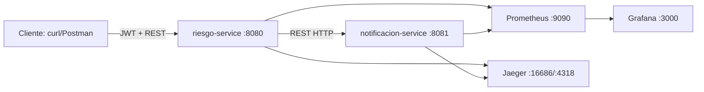
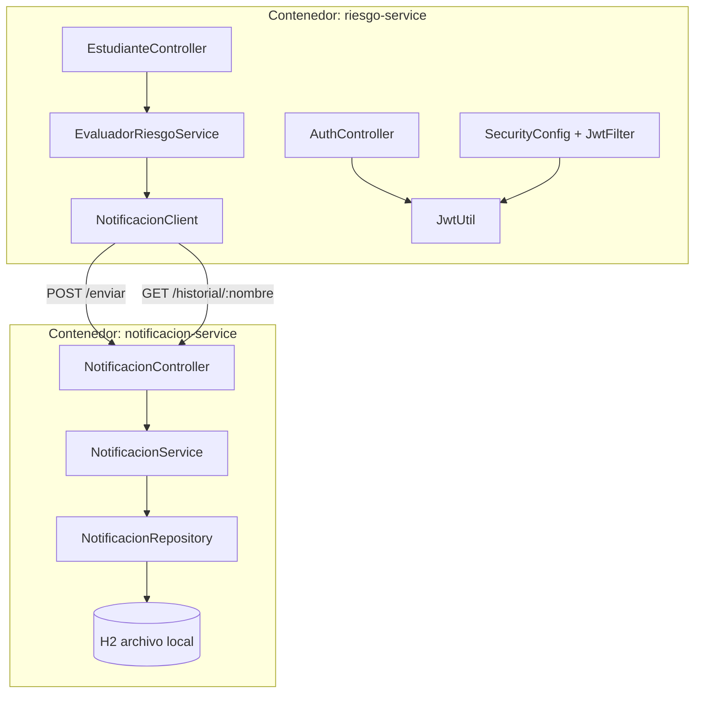
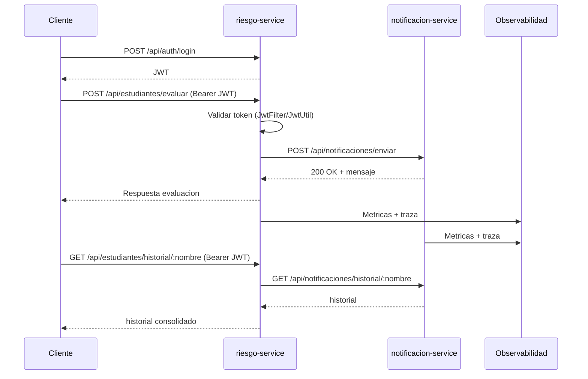

# Documento de Arquitectura del Sistema

## 1. Descripción del sistema

El sistema "Boton de Panico Academico" permite identificar estudiantes en riesgo academico
y activar acciones de apoyo. El objetivo principal es detectar oportunamente niveles de
riesgo (`VERDE`, `AMARILLO`, `ROJO`), registrar eventos de notificacion y consultar historial
por estudiante.

En el corte actual, el sistema opera como arquitectura orientada a servicios con dos
microservicios independientes que se comunican por REST.

---

## 2. Arquitectura inicial (Corte 1)

La primera version se implemento como monolito Java, con clases de dominio y logica
acoplada en un solo proceso:

- `Estudiante.java` - Modelo de dominio.
- `NivelRiesgo.java` - Enumeracion de niveles de riesgo.
- `EvaluadorRiesgoService.java` - Evaluacion de riesgo (Observer).
- `ApoyoFactory.java` - Seleccion de apoyo segun nivel (Factory).
- `NotificadorRiesgo.java` - Notificacion local por consola.

Limitaciones identificadas:

- Sin API REST externa.
- Sin separacion proveedor/consumidor de servicios.
- Sin tolerancia a fallos de dependencias remotas.
- Sin trazabilidad distribuida ni tablero de metricas.
- Sin autenticacion centralizada de endpoints de negocio.

---

## 3. Arquitectura evolucionada (Corte 2)

La solucion evoluciona a microservicios:

- `riesgo-service` (`:8080`): expone endpoints de negocio, aplica JWT y resiliencia.
- `notificacion-service` (`:8081`): recibe notificaciones y persiste historial.
- Comunicacion interna: REST HTTP desde `riesgo-service` hacia `notificacion-service`.
- Observabilidad: Prometheus + Grafana + Jaeger.

Detalles por servicio:

### `riesgo-service`

- API REST: `/api/auth/*`, `/api/estudiantes/*`.
- Seguridad: filtro JWT (`SecurityConfig`, `JwtUtil`).
- Resiliencia en cliente remoto: `NotificacionClient`.
- Metricas custom: `estudiantes.evaluados.total`, `alertas.criticas.total`.
- Tracing OTLP: `otel.service.name=riesgo-service`.

### `notificacion-service`

- API REST: `/api/notificaciones/*`.
- Persistencia propia con H2 en archivo local.
- Endpoints para registrar y consultar historial.
- Tracing OTLP: `otel.service.name=notificacion-service`.

---

## 4. Investigacion sobre resiliencia

Se investigaron y aplicaron los patrones solicitados sobre la comunicacion entre servicios:

- Circuit Breaker
- Retry
- Timeout
- Fallback

Implementacion tecnica (Resilience4j + cliente HTTP):

- Anotaciones en `NotificacionClient`:
  - `@CircuitBreaker(name = "notificacionService", fallbackMethod = "...")`
  - `@Retry(name = "notificacionService")`
  - `@TimeLimiter(name = "notificacionService")`
- Ejecucion asincrona con `CompletableFuture` para habilitar `TimeLimiter`.
- Timeouts de red en `RestTemplate` via `ResilienceConfig`:
  - `http.client.connect-timeout-ms=2000`
  - `http.client.read-timeout-ms=5000`
- Fallbacks implementados:
  - `fallbackNotificar(...)`: devuelve mensaje degradado.
  - `fallbackHistorial(...)`: devuelve `[]`.

Configuracion principal (`riesgo-service/src/main/resources/application.properties`):

- `resilience4j.circuitbreaker.instances.notificacionService.failure-rate-threshold=50`
- `resilience4j.circuitbreaker.instances.notificacionService.wait-duration-in-open-state=10s`
- `resilience4j.retry.instances.notificacionService.max-attempts=3`
- `resilience4j.retry.instances.notificacionService.wait-duration=2s`
- `resilience4j.timelimiter.instances.notificacionService.timeout-duration=5s`
- `resilience4j.timelimiter.instances.notificacionService.cancelRunningFuture=true`

---

## 5. Observabilidad implementada

### Prometheus (recoleccion de metricas)

- Ambos servicios exponen `/actuator/prometheus`.
- Scrape configurado en `monitoring/prometheus.yml`:
  - `host.docker.internal:8080` (`riesgo-service`)
  - `host.docker.internal:8081` (`notificacion-service`)
- Metricas relevantes:
  - `estudiantes_evaluados_total`
  - `alertas_criticas_total`
  - `http_server_requests_seconds_*`
  - `resilience4j_circuitbreaker_state`

### Grafana (visualizacion)

- Desplegado en Docker (`:3000`).
- Datasource Prometheus (`http://prometheus:9090`).
- Dashboards para latencia, throughput y contadores de negocio.

### Jaeger (tracing distribuido)

- Desplegado en Docker (`:16686` UI, `:4318` OTLP HTTP).
- Ambos servicios envian trazas al mismo collector OTLP:
  - `management.tracing.sampling.probability=1.0`
  - `otel.exporter.otlp.endpoint=http://localhost:4318`
- Se observa traza end-to-end del flujo:
`riesgo-service` -> `notificacion-service`.

---

## 6. Evidencia de funcionalidades cubiertas

Las condiciones minimas (al menos dos funcionalidades/endpoints) se cumplen en los siguientes
flujos de negocio:

| Funcionalidad       | Endpoint expuesto                         | Comunicacion entre servicios                 | Resiliencia                                  | Observabilidad                              | Seguridad         |
| ------------------- | ----------------------------------------- | -------------------------------------------- | -------------------------------------------- | ------------------------------------------- | ----------------- |
| Evaluar riesgo      | `POST /api/estudiantes/evaluar`           | `POST /api/notificaciones/enviar`            | Circuit Breaker + Retry + Timeout + Fallback | Metricas HTTP y negocio + traza distribuida | Protegido por JWT |
| Consultar historial | `GET /api/estudiantes/historial/{nombre}` | `GET /api/notificaciones/historial/{nombre}` | Circuit Breaker + Retry + Timeout + Fallback | Metricas HTTP + traza distribuida           | Protegido por JWT |

Evidencia en codigo:

- Consumidor REST: `riesgo-service/.../client/NotificacionClient.java`
- Proveedor REST: `notificacion-service/.../controller/NotificacionController.java`
- Logica de negocio que invoca cliente remoto: `riesgo-service/.../service/EvaluadorRiesgoService.java`
- Proteccion de endpoints y validacion de token: `riesgo-service/.../config/SecurityConfig.java`, `riesgo-service/.../security/JwtUtil.java`

---

## 7. Diagramas arquitectonicos

Los diagramas tambien se encuentran organizados en archivos fuente Mermaid:

- `diagramas/src/arquitectura-general.mmd`
- `diagramas/services/componentes-contenedores.mmd`
- `diagramas/client/interaccion-servicios.mmd`
- `diagramas/monitoring/observabilidad.mmd`

### 7.1 Arquitectura general

### 7.2 Diagrama de componentes y contenedores

### 7.3 Interaccion entre servicios (secuencia)

---

## Referencias internas del repositorio

- `docs/resiliencia.md`
- `docs/observabilidad.md`
- `docs/seguridad.md`
- `README.md`

