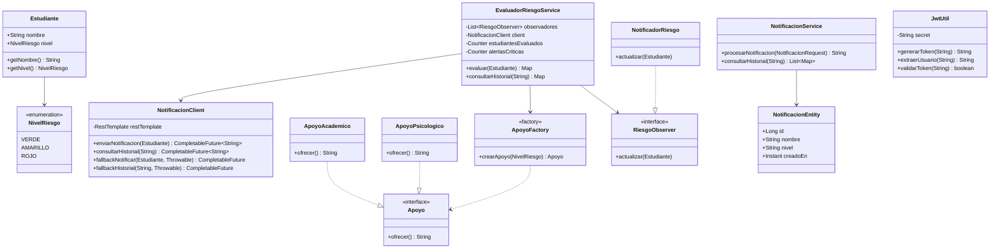
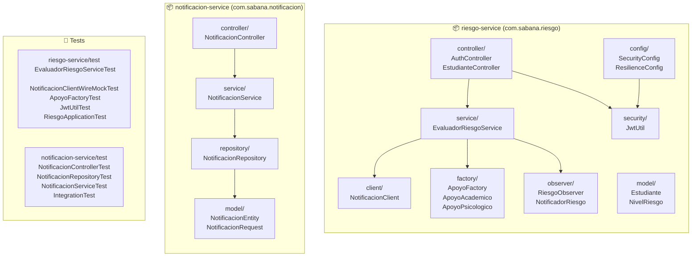
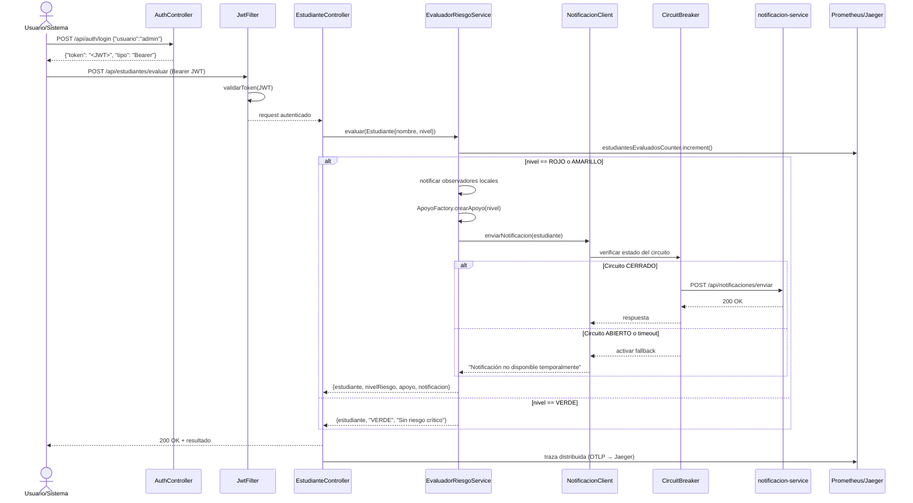
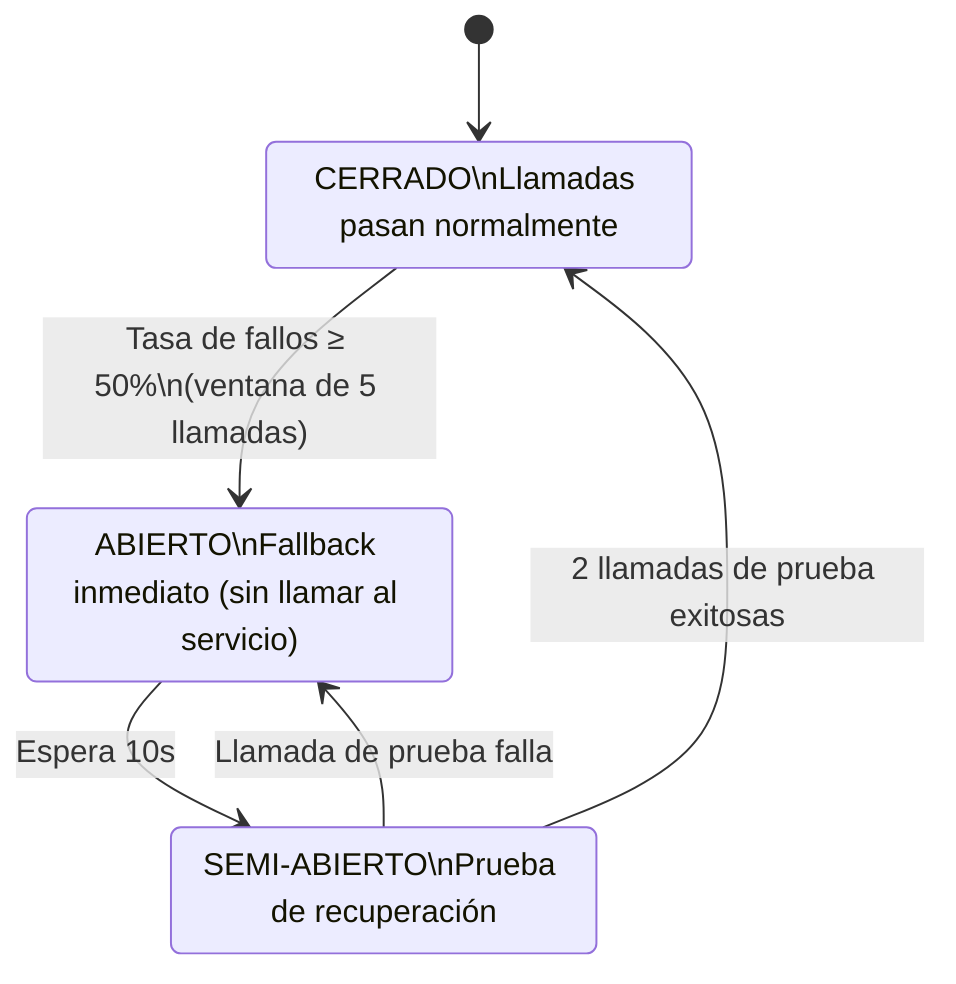
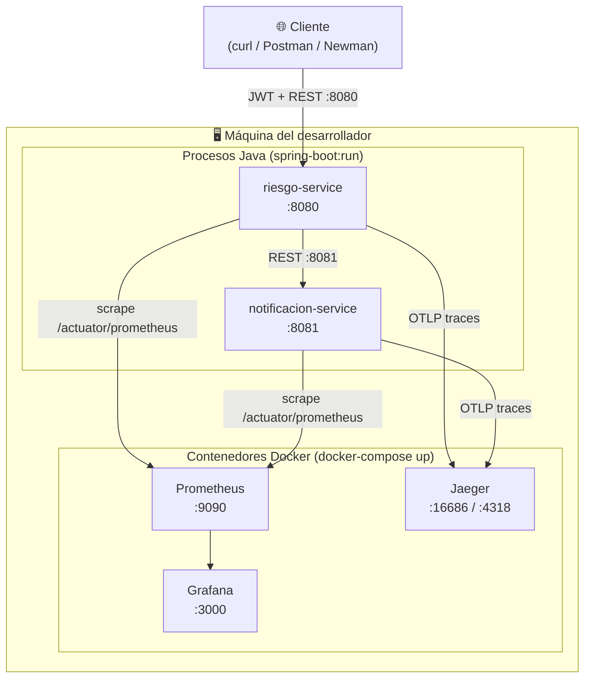
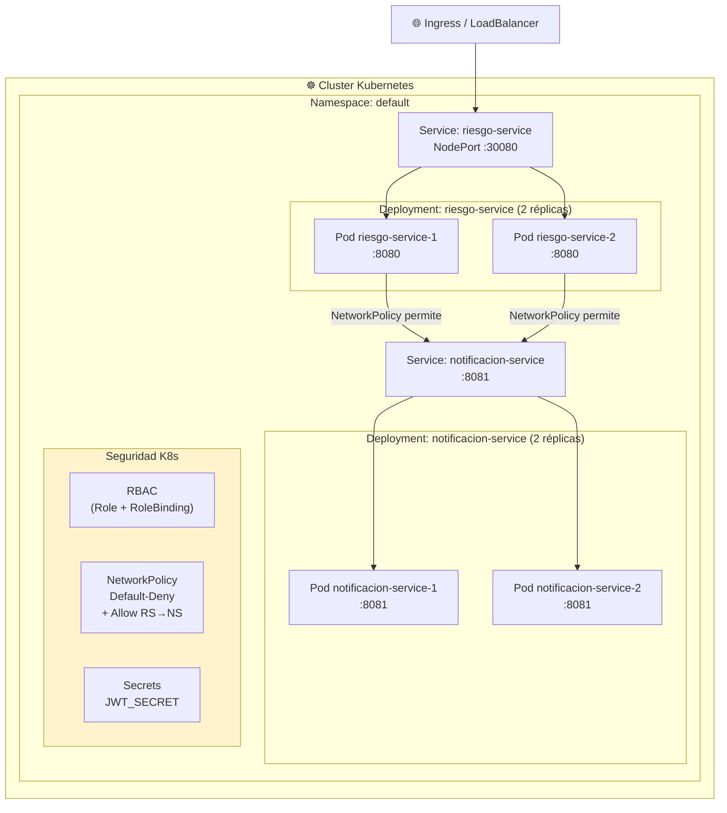
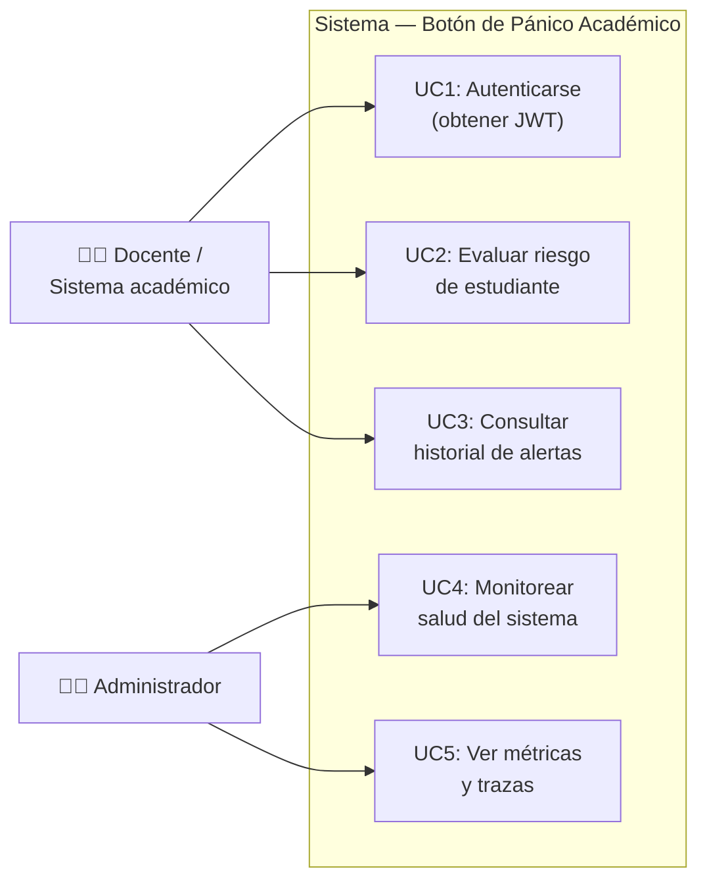

# Modelo 4+1 — Botón de Pánico Académico (Corte 3)

**Autores:** Maria Alejandra Cabrera Arauz · Laura Vanessa Reyes Martinez · Juan Esteban Ramirez Hermosa  
**Curso:** Diseño y Arquitectura de Software  
**Profesor:** César Augusto Vega Fernández

---

El modelo 4+1 (Kruchten, 1995) describe la arquitectura del sistema desde cinco perspectivas
complementarias. Cada vista responde a las necesidades de un grupo de stakeholders diferente.

---

## Vista 1 — Lógica (Logical View)

**Audiencia:** Diseñadores y desarrolladores.  
**Describe:** Estructura de dominio del sistema: entidades, servicios y sus relaciones.

**Patrones de diseño aplicados:**

| Patrón | Clase | Propósito |
|--------|-------|-----------|
| Factory | `ApoyoFactory` | Crea el tipo de apoyo correcto según nivel de riesgo |
| Observer | `RiesgoObserver` / `NotificadorRiesgo` | Notifica localmente ante cambio de estado |
| Circuit Breaker | `NotificacionClient` | Protege llamadas remotas al notificacion-service |

---

## Vista 2 — Desarrollo (Development / Implementation View)

**Audiencia:** Desarrolladores.  
**Describe:** Organización del código fuente en módulos y paquetes.

**Dependencias externas clave:**

| Librería | Versión | Uso |
|----------|---------|-----|
| Spring Boot | 3.2.3 | Framework base |
| Resilience4j | 2.2.0 | Circuit Breaker, Retry, TimeLimiter |
| JJWT | 0.11.5 | Generación y validación de tokens JWT |
| WireMock | 3.4.2 | Mocking de HTTP en pruebas |
| JaCoCo | 0.8.11 | Cobertura de código (umbral ≥ 80%) |
| Allure | 2.25.0 | Reportes visuales de pruebas |

---

## Vista 3 — Proceso (Process View)

**Audiencia:** Integradores, QA.  
**Describe:** Comportamiento dinámico del sistema: flujos de ejecución, concurrencia y resiliencia.

### Flujo principal: Evaluar riesgo

### Flujo de resiliencia: Circuit Breaker

---

## Vista 4 — Física (Physical / Deployment View)

**Audiencia:** DevOps, operaciones, infraestructura.  
**Describe:** Cómo se despliegan los componentes sobre la infraestructura real.

### Despliegue local (Docker Compose)

### Despliegue en producción (Kubernetes)

**Configuración de alta disponibilidad:**

| Aspecto | Configuración |
|---------|--------------|
| Réplicas por servicio | 2 pods |
| Liveness probe | `GET /api/.../health` cada 30s |
| Readiness probe | `GET /api/.../health` cada 10s |
| Política de red | Default-deny + allow explícito RS→NS:8081 |
| Control de acceso | RBAC con permisos mínimos (solo lectura de pods) |
| Secretos | `JWT_SECRET` via Kubernetes Secrets |

---

## Vista +1 — Escenarios (Use Cases)

**Audiencia:** Todos los stakeholders.  
**Describe:** Los casos de uso que guían y validan las cuatro vistas anteriores.

| Caso de uso | Endpoints involucrados | Vista Lógica | Vista Proceso | Vista Física |
|-------------|----------------------|--------------|---------------|--------------|
| UC1: Autenticarse | `POST /api/auth/login` | `AuthController`, `JwtUtil` | Genera token firmado HS256 | riesgo-service pod |
| UC2: Evaluar riesgo | `POST /api/estudiantes/evaluar` | `EvaluadorRiesgoService`, `ApoyoFactory`, `NotificacionClient` | Circuit Breaker + Observer + métricas | riesgo-service → notificacion-service |
| UC3: Consultar historial | `GET /api/estudiantes/historial/{nombre}` | `NotificacionClient` → `NotificacionService` | Circuit Breaker + H2 query | Cross-service REST call |
| UC4: Health check | `GET .../health` | Ambos controllers | Respuesta inmediata, sin JWT | Kubernetes probes |
| UC5: Métricas/trazas | `/actuator/prometheus`, Grafana, Jaeger | Micrometer, OpenTelemetry | Exportación asíncrona OTLP | Stack de observabilidad |

---

## Resumen de correspondencia vistas

| Vista | Stakeholder principal | Herramienta/Artefacto |
|-------|-----------------------|----------------------|
| Lógica | Arquitecto, desarrollador | Diagrama de clases (Mermaid) |
| Desarrollo | Desarrollador, CI/CD | Estructura de paquetes Maven |
| Proceso | QA, integrador | Diagrama de secuencia + estados |
| Física | DevOps, infraestructura | docker-compose.yml, k8s/ manifests |
| Escenarios | Cliente, PO | Casos de uso + tabla de trazabilidad |
