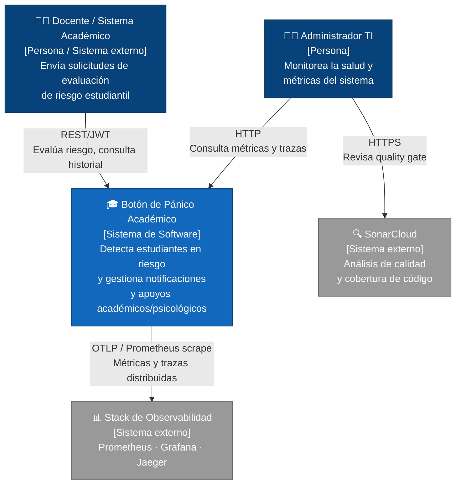
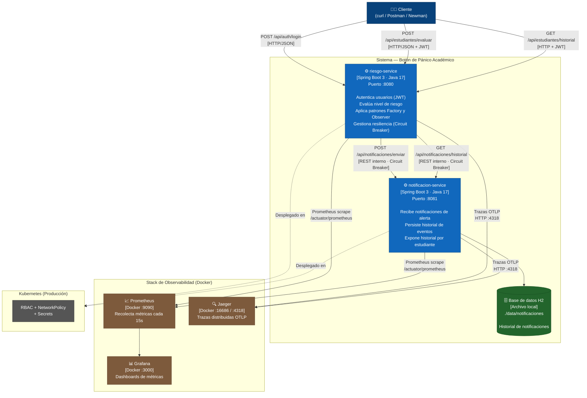
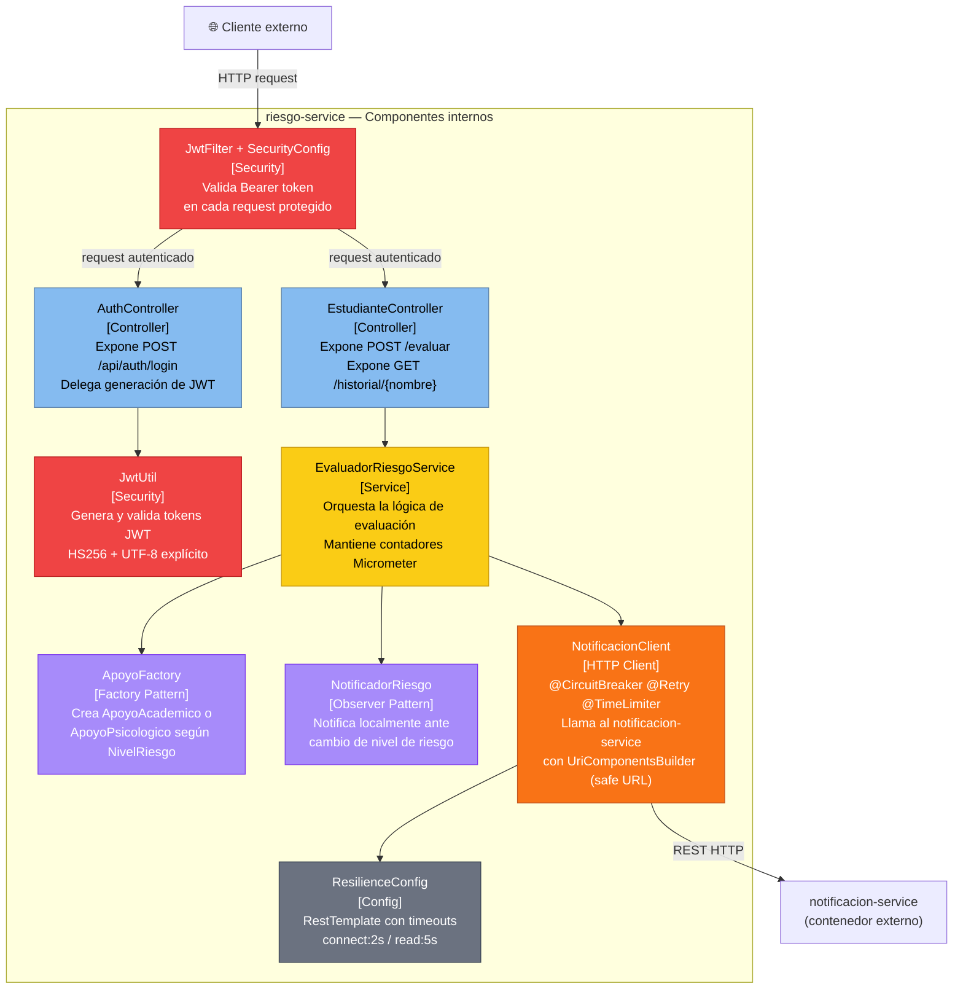
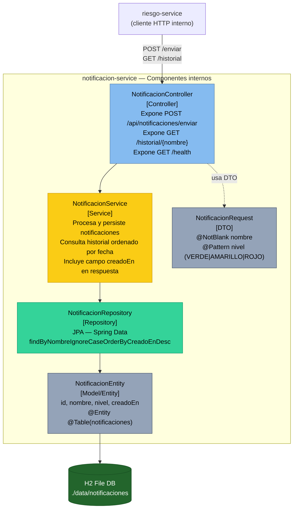

# Modelo C4 — Botón de Pánico Académico (Corte 3)

**Autores:** Maria Alejandra Cabrera Arauz · Laura Vanessa Reyes Martinez · Juan Esteban Ramirez Hermosa  
**Curso:** Diseño y Arquitectura de Software  
**Profesor:** César Augusto Vega Fernández

---

El modelo C4 (Simon Brown) describe la arquitectura en cuatro niveles de abstracción:
**Contexto → Contenedores → Componentes → Código**.
Cada nivel hace zoom sobre el interior del anterior.

---

## Nivel 1 — Diagrama de Contexto (System Context)

**Pregunta:** ¿Qué hace el sistema y con quién interactúa?

**Relaciones clave:**
- El **Docente/Sistema académico** es el actor principal: autentica con JWT y evalúa estudiantes.
- El **Administrador TI** monitorea salud via Grafana y Jaeger.
- El sistema exporta métricas y trazas de forma pasiva al stack de observabilidad.

---

## Nivel 2 — Diagrama de Contenedores (Container Diagram)

**Pregunta:** ¿Cuáles son los principales ejecutables/servicios y cómo se comunican?

**Tecnología por contenedor:**

| Contenedor | Tecnología | Puerto | Protocolo |
|-----------|-----------|--------|-----------|
| riesgo-service | Spring Boot 3 / Java 17 | 8080 | HTTP/REST |
| notificacion-service | Spring Boot 3 / Java 17 / H2 | 8081 | HTTP/REST |
| Prometheus | Docker image `prom/prometheus` | 9090 | HTTP scrape |
| Grafana | Docker image `grafana/grafana` | 3000 | HTTP |
| Jaeger | Docker image `jaegertracing/all-in-one` | 16686/4318 | HTTP/OTLP |

---

## Nivel 3 — Diagrama de Componentes (Component Diagram)

### riesgo-service

**Pregunta:** ¿Cuáles son los componentes internos de riesgo-service?

### notificacion-service

**Pregunta:** ¿Cuáles son los componentes internos de notificacion-service?

---

## Nivel 4 — Código (Code Level)

El nivel 4 es opcional en C4 y generalmente se omite para evitar documentación que se desincroniza con el código. En este proyecto, el código fuente es la fuente de verdad:

| Clase | Archivo |
|-------|---------|
| `EvaluadorRiesgoService` | `riesgo-service/src/main/java/com/sabana/riesgo/service/EvaluadorRiesgoService.java` |
| `NotificacionClient` | `riesgo-service/src/main/java/com/sabana/riesgo/client/NotificacionClient.java` |
| `ApoyoFactory` | `riesgo-service/src/main/java/com/sabana/riesgo/factory/ApoyoFactory.java` |
| `JwtUtil` | `riesgo-service/src/main/java/com/sabana/riesgo/security/JwtUtil.java` |
| `NotificacionService` | `notificacion-service/src/main/java/com/sabana/notificacion/service/NotificacionService.java` |
| `NotificacionEntity` | `notificacion-service/src/main/java/com/sabana/notificacion/model/NotificacionEntity.java` |

---

## Comparación: C4 vs 4+1

| Nivel C4 | Vista 4+1 equivalente | Enfoque |
|----------|-----------------------|---------|
| Contexto (L1) | Escenarios (+1) | Sistema en su entorno |
| Contenedores (L2) | Física + Desarrollo | Servicios desplegables |
| Componentes (L3) | Lógica + Desarrollo | Clases e interfaces |
| Código (L4) | Lógica (detallada) | Implementación concreta |
