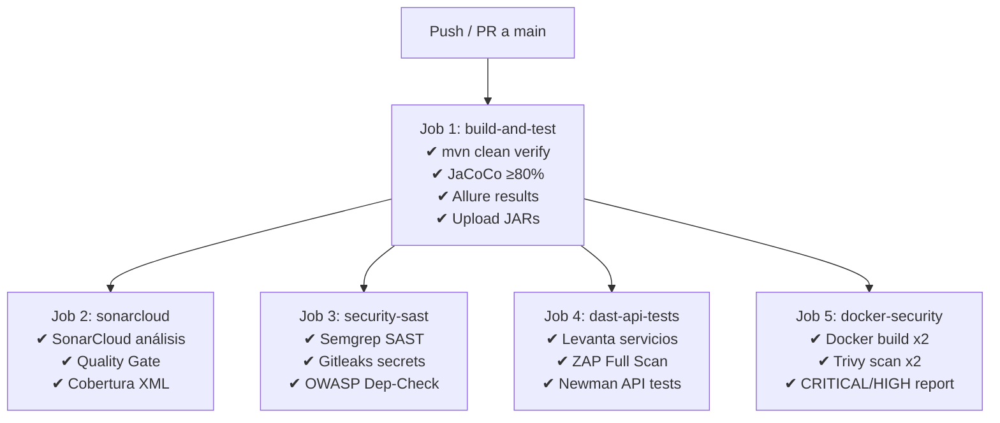

# Estrategia de Pruebas, CI/CD y DevSecOps (Corte 3)

**Autores:** Maria Alejandra Cabrera Arauz · Laura Vanessa Reyes Martinez · Juan Esteban Ramirez Hermosa  
**Curso:** Diseño y Arquitectura de Software  
**Profesor:** César Augusto Vega Fernández

---

## 1. Estrategia de Pruebas

El sistema aplica una pirámide de pruebas que combina velocidad y confianza: pruebas unitarias
rápidas en la base, integración con WireMock en el centro, y API/carga en la cima.

```
           ▲
          /  \        Pruebas de carga (k6)
         /────\       Pruebas de API (Newman/Postman)
        /      \
       /────────\     Pruebas de integración (WireMock, @SpringBootTest)
      /          \
     /────────────\   Pruebas unitarias (JUnit 5 + Mockito)
    /              \
   ▔▔▔▔▔▔▔▔▔▔▔▔▔▔▔▔
```

---

## 2. Pruebas Unitarias

**Herramienta:** JUnit 5 + Mockito  
**Cobertura mínima:** ≥ 80% de instrucciones (enforced por JaCoCo en fase `verify`)

### riesgo-service

| Clase de test | Clase bajo prueba | Casos cubiertos |
|---------------|-------------------|-----------------|
| `EvaluadorRiesgoServiceTest` | `EvaluadorRiesgoService` | VERDE no llama al cliente; ROJO llama y propaga respuesta; historial delega en cliente |
| `ApoyoFactoryTest` | `ApoyoFactory` | ROJO → `ApoyoPsicologico`; AMARILLO → `ApoyoAcademico`; VERDE → `IllegalArgumentException` |
| `JwtUtilTest` | `JwtUtil` | Generación de token; extracción de usuario; validación; token manipulado; cadena vacía; tokens distintos por timestamp |
| `RiesgoApplicationTest` | Contexto Spring | Carga del contexto completo |

### notificacion-service

| Clase de test | Clase bajo prueba | Casos cubiertos |
|---------------|-------------------|-----------------|
| `NotificacionServiceTest` | `NotificacionService` | Persistencia con datos correctos; mensaje de confirmación; historial incluye `creadoEn`; lista vacía |
| `NotificacionRepositoryTest` | `NotificacionRepository` | Búsqueda case-insensitive ordenada por fecha desc |

**Ejecutar:**
```bash
cd riesgo-service && mvn test
cd notificacion-service && mvn test
```

---

## 3. Pruebas Autónomas (Mockito + WireMock)

### Mockito — `EvaluadorRiesgoServiceTest`

Mockito aísla `EvaluadorRiesgoService` del `NotificacionClient` real:

```java
@Mock NotificacionClient notificacionClient;
// ...
when(notificacionClient.enviarNotificacion(any())).thenReturn(
    CompletableFuture.completedFuture("notif-ok")
);
```

**Ventaja:** Las pruebas son deterministas y no requieren red.

### WireMock — `NotificacionClientWireMockTest`

WireMock levanta un servidor HTTP falso en puerto dinámico para simular el `notificacion-service`
real. Verifica el comportamiento del cliente HTTP ante distintos escenarios:

| Escenario | Comportamiento esperado |
|-----------|------------------------|
| Servicio responde 200 | Retorna el body de la respuesta |
| Servicio responde 500 | Activa el fallback del Circuit Breaker |
| Historial disponible | Retorna JSON correctamente |
| Servicio caído (503) | Retorna `"[]"` por fallback |
| Nombre con caracteres especiales | URL correctamente codificada (`Juan%20P%C3%A9rez`) |

```java
@SpringBootTest
class NotificacionClientWireMockTest {
    static WireMockServer wireMock = new WireMockServer(
        WireMockConfiguration.wireMockConfig().dynamicPort()
    );

    @DynamicPropertySource
    static void overrideServiceUrl(DynamicPropertyRegistry registry) {
        wireMock.start();
        registry.add("notificacion.service.url", wireMock::baseUrl);
    }
    // ...
}
```

**Por qué WireMock es superior a un mock Mockito para este caso:**
- Prueba la capa HTTP real (serialización, headers, status codes)
- Verifica que `UriComponentsBuilder` codifica la URL correctamente
- Valida el comportamiento del Circuit Breaker ante respuestas HTTP reales (500/503)

---

## 4. Pruebas de Integración

### `NotificacionApplicationIntegrationTest`

Usa `@SpringBootTest` + `@AutoConfigureMockMvc` y una base de datos H2 en memoria real:

```java
@SpringBootTest
@AutoConfigureMockMvc
class NotificacionApplicationIntegrationTest {
    @Test
    void enviarYConsultarHistorial_persisteYRecupera() throws Exception {
        // POST /enviar → verifica persistencia en DB
        // GET /historial → verifica recuperación ordenada
    }
}
```

### `NotificacionControllerTest`

`@WebMvcTest` prueba el controller de forma aislada con Spring MVC real pero sin arrancar el servidor:

```java
@WebMvcTest(NotificacionController.class)
class NotificacionControllerTest {
    @MockBean NotificacionService notificacionService;
    // Prueba validación @Valid, headers, status codes
}
```

---

## 5. Pruebas de API (Postman + Newman)

**Herramienta:** Postman Collection v2.1 ejecutada con Newman  
**Archivo:** `tests/api/postman_collection.json`

### Estructura de la colección

```
Botón de Pánico Académico — API Tests
├── Health Checks
│   ├── Health riesgo-service (GET /api/estudiantes/health)
│   └── Health notificacion-service (GET /api/notificaciones/health)
├── Autenticación
│   ├── Login — obtener token JWT ← guarda token en variable de colección
│   └── Login — usuario vacío retorna 400
├── Evaluación de Riesgo
│   ├── Evaluar nivel ROJO
│   ├── Evaluar nivel AMARILLO
│   ├── Evaluar nivel VERDE (sin alerta)
│   ├── Sin token retorna 401/403
│   └── Nombre vacío retorna 400 (validación @Valid)
└── Historial
    ├── Consultar con registros previos
    └── Sin token retorna 401/403
```

**Flujo automático:** El request de login guarda el JWT en `pm.collectionVariables`, los demás requests lo reutilizan con `{{TOKEN}}`.

**Ejecutar localmente:**
```bash
npm install -g newman newman-reporter-htmlextra
newman run tests/api/postman_collection.json \
  --env-var BASE_URL=http://localhost:8080 \
  --env-var NOTIF_URL=http://localhost:8081 \
  --reporters cli,htmlextra \
  --reporter-htmlextra-export reports/newman-report.html
```

---

## 6. Pruebas de Carga (k6)

**Herramienta:** k6  
**Archivo:** `tests/load/script.js`

### Perfil de carga

| Etapa | Duración | Usuarios virtuales |
|-------|----------|--------------------|
| Calentamiento | 30s | 0 → 10 |
| Carga sostenida | 1 min | 50 |
| Pico | 30s | 50 → 100 |
| Bajada | 30s | 100 → 0 |

### Flujo por usuario virtual

```
1. Login (POST /api/auth/login) → obtener JWT
2. Health check (GET /api/estudiantes/health)
3. Evaluar riesgo (POST /api/estudiantes/evaluar) con nombre y nivel aleatorios
4. Consultar historial (GET /api/estudiantes/historial/{nombre})
```

### Umbrales de aceptación

| Métrica | Umbral |
|---------|--------|
| `http_req_failed` | < 5% |
| `http_req_duration` p(95) | < 2.000 ms |
| `evaluar_latency_ms` p(95) | < 1.500 ms |
| `errors` (custom) | < 5% |

**Ejecutar:**
```bash
k6 run tests/load/script.js

# Con variables de entorno para CI
k6 run -e BASE_URL=http://localhost:8080 \
        -e NOTIF_URL=http://localhost:8081 \
        tests/load/script.js
```

---

## 7. Pipeline CI/CD

**Herramienta:** GitHub Actions  
**Archivo:** `.github/workflows/ci-cd-pipeline.yml`

### Diagrama de flujo del pipeline



### Descripción de cada job

**Job 1 — build-and-test**
- Compila y ejecuta todos los tests (unitarios, WireMock, integración)
- JaCoCo verifica cobertura ≥ 80%; el build falla si no se cumple
- Sube JARs como artefactos para el job de DAST
- Sube reportes Surefire y Allure

**Job 2 — sonarcloud**
- Análisis estático completo con SonarCloud (requiere `SONAR_TOKEN` en secrets)
- Verifica Quality Gate (cobertura, duplicación, bugs, code smells)
- Configuración: `sonar.projectKey=sabana_{service}`, `sonar.organization=sabana`

**Job 3 — security-sast**
- **Semgrep**: detecta vulnerabilidades en el código fuente (OWASP Top 10, inyecciones)
- **Gitleaks**: escanea el historial de commits en busca de secretos filtrados
- **OWASP Dependency-Check**: analiza dependencias Maven por CVEs conocidos (ambos servicios)

**Job 4 — dast-api-tests**
- Descarga los JARs del job 1 y los inicia como procesos en background
- Espera a que los health endpoints respondan (hasta 90 segundos)
- **OWASP ZAP Full Scan**: escaneo activo HTTP sobre ambos servicios en caliente
- **Newman**: ejecuta la colección Postman completa contra los servicios reales
- Reglas ZAP configuradas en `.zap/rules.tsv` para suprimir falsos positivos de REST APIs

**Job 5 — docker-security**
- Construye imágenes Docker con los Dockerfiles de cada servicio
- **Trivy**: escanea ambas imágenes por vulnerabilidades CRITICAL y HIGH en OS y librerías
- Reportes en formato JSON subidos como artefactos

### Configuración requerida en GitHub

| Secret/Variable | Descripción | Obligatorio |
|----------------|-------------|-------------|
| `SONAR_TOKEN` | Token de SonarCloud | Para Job 2 |
| `GITHUB_TOKEN` | Generado automáticamente por GitHub | Para Job 3 (Gitleaks) |

---

## 8. Cobertura de Código (JaCoCo)

El umbral de cobertura del **80% de instrucciones** está configurado en ambos `pom.xml`:

```xml
<execution>
    <id>jacoco-check</id>
    <phase>verify</phase>
    <goals><goal>check</goal></goals>
    <configuration>
        <rules>
            <rule>
                <element>BUNDLE</element>
                <limits>
                    <limit>
                        <counter>INSTRUCTION</counter>
                        <value>COVEREDRATIO</value>
                        <minimum>0.80</minimum>
                    </limit>
                </limits>
            </rule>
        </rules>
    </configuration>
</execution>
```

**Ver el reporte de cobertura:**
```bash
mvn clean verify
open target/site/jacoco/index.html
```

---

## 9. Reportes Visuales (Allure)

**Herramienta:** Allure Report 2.25.0  
**Dependencia:** `allure-junit5` en ambos `pom.xml`

Los resultados se generan en `target/allure-results/` y se publican como artefacto en el pipeline.

**Generar y ver el reporte localmente:**
```bash
# Instalar Allure CLI: https://allurereport.org/docs/install/
mvn clean test
allure serve target/allure-results
```

---

## 10. Decisiones de Seguridad

| Decisión | Justificación |
|----------|--------------|
| JWT secret via `${JWT_SECRET:...}` | El secreto no debe estar en el código fuente; se inyecta como variable de entorno en CI y Kubernetes Secrets en producción |
| URL con `UriComponentsBuilder` | Elimina el riesgo de path traversal al codificar caracteres especiales en nombres de estudiantes |
| `@Valid` + `@NotBlank` en todos los endpoints | Rechaza requests malformados antes de que lleguen a la lógica de negocio (400 Bad Request) |
| `getBytes(StandardCharsets.UTF_8)` en JwtUtil | Garantiza comportamiento consistente independientemente del sistema operativo |
| ZAP `fail_action: false` | El scan corre en informational mode; las alertas se reportan pero no bloquean el deploy (ajustable según madurez) |
| Trivy `ignore-unfixed: true` | Evita ruido de CVEs sin parche disponible; el equipo prioriza vulnerabilidades accionables |

---

## 11. Retos Técnicos y Soluciones

| Reto | Solución implementada |
|------|-----------------------|
| WireMock necesitaba puerto dinámico para evitar conflictos en CI | `WireMockConfiguration.wireMockConfig().dynamicPort()` + `@DynamicPropertySource` para sobreescribir la URL del servicio |
| ZAP no puede alcanzar `localhost` dentro de su contenedor Docker | Se usa `fail_action: false` y red del host en ubuntu-latest; ZAP action v0.10 maneja el routing automáticamente |
| JARs no estaban disponibles en el job de DAST | Se agregan como artefactos en `build-and-test` con `upload-artifact` y se descargan en `dast-api-tests` con `download-artifact` |
| `getForObject` retornaba `null` silenciosamente | Se agregó guard `response != null ? response : "[]"` en ambos métodos del cliente |
| `ApoyoFactory` tenía un `default` que podía ocultar bugs | Se reemplazó por caso `VERDE` explícito con `IllegalArgumentException` para hacer el fallo visible |
| El historial no incluía timestamp | Se agregó `creadoEn` al map de respuesta para permitir ordenamiento e identificación en el cliente |
